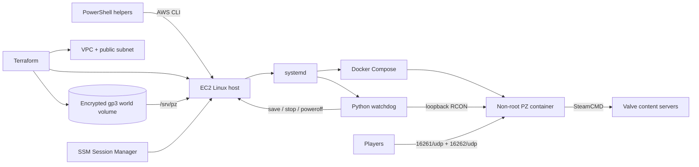

# Project Zomboid Build 42 Dedicated Server

Production-oriented, self-hosted Project Zomboid Build 42 infrastructure for a small group that plays occasionally. The same custom Docker image and Compose definition run on Windows with Docker Desktop and on a Linux EC2 host. Terraform provisions only AWS infrastructure; repository-owned scripts, Docker, and systemd own the application lifecycle.

The world is configured with **`PauseEmpty=true`**. Game time stops whenever no players are connected, so crops, food, generators, animals, and other simulation state do not advance merely because the server remains online during the idle grace period.

No Project Zomboid binaries are stored in Git or baked into the image. SteamCMD downloads dedicated-server App `380870` from Valve into a persistent runtime mount.

## Architecture



| Layer | Responsibility |
| --- | --- |
| Terraform | Network, security group, IAM/SSM, EC2, independent persistent EBS, and optional cost notifications |
| cloud-init | First-boot Docker installation, explicitly authorized volume initialization, and immutable repository checkout |
| Docker/Compose | PZ dependencies, SteamCMD update, configuration, ports, persistence, health, signals |
| systemd | Start Compose and watchdog on boot; recover services after a reboot |
| Python watchdog | Confirm players, track continuous idle time, recover unhealthy PZ, safely stop EC2 |
| PowerShell | Idempotent manual start/resize/status/graceful stop from Windows |

See [architecture details](docs/architecture.md) for boundaries and failure behavior.

## Cost Philosophy

The EC2 instance normally remains **stopped**. Compute charges accrue only while it runs, but the encrypted EBS volumes continue to incur storage charges while stopped. AWS also charges for public IPv4 use according to its current pricing; this project deliberately creates no Elastic IP, NAT Gateway, load balancer, managed database, or default paid observability stack.

AWS prices and policies change. Check the current AWS Pricing Calculator rather than treating any old estimate as permanent. Optional EC2 detailed monitoring is off by default. An opt-in, notification-only AWS Budget can email account-wide actual and forecast monthly-cost warnings without creating automated actions or SNS infrastructure.

## Repository Layout

```text
compose.yaml                 Local and production application definition
Dockerfile                   Custom non-root PZ/SteamCMD image
config/templates/            Version-controlled managed PZ settings
docker/                      Entrypoint, health, and console helpers
src/pz_watchdog/             Typed watchdog, RCON adapter, metrics, CLI
watchdog/tests/              Safety-state and failure-path tests
scripts/linux/               Host installer, pzctl, consistent backup
scripts/windows/             AWS lifecycle/status and local backup helpers
deploy/systemd/              Production services
terraform/                   AWS infrastructure and cloud-init
docs/                        Design and operations detail
runtime/                     Generated local binaries/world/logs; Git-ignored
```

## Local Prerequisites

- Windows 10/11 with WSL2 enabled
- Docker Desktop using Linux containers
- Git
- Windows PowerShell 5.1 or PowerShell 7
- Python 3.11-3.13 only when developing or running host-side status/tests

Allocate enough Docker Desktop memory for the selected JVM and container limits. The example defaults request 2 CPUs, a 10 GiB container limit, and an 8 GiB maximum JVM heap.

## Local Quick Start

```powershell
Copy-Item .env.example .env
notepad .env
docker compose build
docker compose up -d
docker compose logs -f server
```

Replace all three `change-me-*` values in `.env` before starting. Use strong, distinct values for `ADMIN_PASSWORD`, `SERVER_PASSWORD`, and `RCON_PASSWORD`. The first `up` downloads several gigabytes from Steam and can remain in Compose's health `starting` state for many minutes.

Normal commands work as expected:

```powershell
docker compose ps
docker compose restart server
docker compose logs -f server
docker compose down
```

`down`, image rebuilds, and container recreation do not remove `runtime/server` or `runtime/zomboid`. Do not use `docker compose down --volumes` as a cleanup habit, even though the current durable paths are bind mounts.

## Connecting Locally

In Project Zomboid Build 42, choose **Join**, add a favorite, and use:

- IP: `127.0.0.1`
- Port: `16261`
- Server password: `SERVER_PASSWORD` from `.env`
- Username/password: a normal per-player PZ account, not the server admin secret

The verified current Build 42 ports are `16261/udp` (primary gameplay) and `16262/udp` (direct connection). No TCP gameplay rule is added. See [source verification](docs/architecture.md#verified-pz-assumptions).

## Configuration

Important local values are centralized in `.env`; safe examples and comments are in `.env.example`. Windows AWS helpers also read only the five non-secret helper keys listed at the bottom of that file. Terraform remains authoritative for provisioned tags and instance types, which it writes onto the instance for the helpers to discover. `PZ_SERVER_NAME` is the filesystem/save identifier and accepts only letters, numbers, `_`, and `-`. `SERVER_PUBLIC_NAME` is the display name.

On each start, `config/templates/server.ini.template` is rendered and its managed keys are merged into the persistent runtime INI. Generated IDs and unknown settings are preserved. PZ creates the current vanilla Build 42 sandbox and spawn files itself, preventing stale Build 41 templates from silently replacing current defaults.

Runtime locations:

| Content | Local path | Container path |
| --- | --- | --- |
| Downloaded server binaries | `runtime/server` | `/opt/pzserver` |
| Complete persistent PZ user data | `runtime/zomboid` | `/home/pz/Zomboid` |
| Saves/world | `runtime/zomboid/Saves/Multiplayer` | `/home/pz/Zomboid/Saves/Multiplayer` |
| Generated server config | `runtime/zomboid/Server` | `/home/pz/Zomboid/Server` |
| Logs | `runtime/zomboid/Logs` and `console.txt` | `/home/pz/Zomboid/Logs` |

### PauseEmpty

`PauseEmpty=true` is a managed invariant, not an optional optimization. The watchdog still leaves the host online for 45 confirmed-empty minutes, but the simulation remains paused throughout that period. Do not change this casually.

## RCON and Local Administration

RCON uses Source RCON through checksum-pinned [`rcon-cli`](https://github.com/itzg/rcon-cli), not a project-specific protocol implementation. Compose publishes `27015/tcp` only on `127.0.0.1`; AWS has no RCON security-group rule.

```powershell
docker compose exec -T server rcon-cli --host 127.0.0.1 players
docker compose exec -T server rcon-cli --host 127.0.0.1 save
docker compose exec -T server pz-console help
.\scripts\windows\Test-PZRcon.ps1 -ExpectedPlayers 0
```

The smoke helper compares the real Build 42 response with the strict watchdog adapter and deliberately uses a wrong credential to prove unavailable RCON returns `UNKNOWN` with exit code `2`. Run it again with `-ExpectedPlayers 1` while a test client is connected. The complete manual procedure is in [the acceptance checklist](docs/acceptance.md).

`docker stop` sends `SIGTERM` to a PID 1 signal handler. It writes `save`, waits, writes `quit`, verifies exit, and only escalates after the configured grace period. Compose allows 120 seconds for this path.

## Watchdog

The local optional sidecar is always forced to `DRY_RUN=true` and has neither the Docker socket nor host-shutdown capability:

```powershell
docker compose --profile watchdog up -d
docker compose logs -f watchdog
```

Production behavior:

1. Query `players` through RCON up to 3 times, waiting 5 seconds between attempts.
2. A valid count above zero resets idle state. A valid zero starts or advances the 45-minute timer.
3. Any timeout, authentication error, extra/contradictory output, malformed output, or exhausted retry set produces `UNKNOWN`, never zero. `UNKNOWN` clears idle state and prohibits shutdown.
4. Docker health independently checks the PZ process, not RCON. Only if RCON is unknown and that separate process/container health is explicitly bad for 12 continuous minutes may the watchdog restart PZ, never EC2. Recovered idle state starts fresh.
5. At 45 continuous confirmed-empty minutes, require three successful zero observations separated by 5 seconds.
6. Any player or `UNKNOWN` final check aborts. Otherwise query once more, save with a recognized `World saved` response, settle, and query again. A player or `UNKNOWN` at either shutdown-phase check aborts.
7. Gracefully stop the one exact Compose container, require the full clean state (`Status=exited`, not running/restarting/dead/OOM-killed, exit code `0`, and no Docker error), reverify its identity, then initiate Linux poweroff immediately. Missing, multiple, changed, or uninspectable containers are unknown, never proof of a stop.
8. Linux/AWS mode, `DRY_RUN=false`, `HOST_SHUTDOWN_ENABLED=true`, and an exact root-owned guard file are all required for real host shutdown.

There is no reliable supported second PZ player-count interface. Process/container checks are used only to decide whether the service needs recovery; they are **never** converted into an empty-player result. See [watchdog design](docs/watchdog.md).

## Local Status and Tests

Install the pinned development dependencies in an isolated environment:

```powershell
python -m venv .venv
.\.venv\Scripts\python -m pip install -e ".[dev]"
.\.venv\Scripts\pz-watchdog status
.\.venv\Scripts\pytest
.\.venv\Scripts\ruff check .
.\.venv\Scripts\ruff format --check .
```

Host status reads real CPU utilization per core, hottest core, total/available memory, PZ JVM RSS when the host PID is visible, boot/container uptime, disk usage, container health, and RCON player count. On Docker Desktop, Linux PIDs live inside its VM; if the JVM RSS cannot be observed honestly, status reports `unavailable` rather than inventing a value.

The JSON form used by AWS tooling is `pz-watchdog status --json`.

## Local Resource-Limit Testing

Change these four `.env` values before `docker compose up -d --force-recreate`:

| Scenario | `CONTAINER_CPUS` | `CONTAINER_MEMORY_LIMIT` | `PZ_XMS` | `PZ_XMX` |
| --- | ---: | ---: | ---: | ---: |
| Constrained | `2.0` | `8g` | `2g` | `6g` |
| Normal target memory | `2.0` | `14g` | `4g` | `8g` |
| Larger local session | `4.0` | `14g` | `4g` | `12g` |

Docker Desktop's own WSL2 VM limit must be at least as large. These experiments expose heap behavior, OOM handling, configuration errors, and future mod pressure. They do **not** benchmark an AWS EPYC core: local CPU architecture, boost behavior, virtualization, storage, and contention differ.

The container entrypoint refuses startup unless `PZ_XMS <= PZ_XMX < CONTAINER_MEMORY_LIMIT`, preserving explicit headroom for native, direct-buffer, thread-stack, and other non-heap memory.

Start AWS sessions in normal mode and watch the hottest core, total/available memory, JVM RSS, logs, and player-observed lag during representative combat/vehicle/mod loads. A hottest core repeatedly near saturation with healthy memory is a stronger scale-up signal than player count alone because PZ has main-thread bottlenecks; memory exhaustion or OOM requires heap/mod investigation, not blindly more vCPUs. Party mode exposes four host CPUs instead of two but does not promise a particular player capacity or reproduce a local CPU's per-core performance.

## Backups and Restore

Create a consistent local backup. The script always refuses unknown player state, refuses known connected players unless `-AllowConnectedPlayers` is explicit, confirms the save, rechecks players, verifies a clean exact-container stop, archives, checksums, and restores the previous running state:

```powershell
.\scripts\windows\Backup-PZLocal.ps1
```

For a maintenance backup after warning connected players:

```powershell
.\scripts\windows\Backup-PZLocal.ps1 -AllowConnectedPlayers
```

The local default retains the newest seven archives. To schedule a daily application-consistent attempt with Windows Task Scheduler, run once from an elevated shell and replace the time if needed:

```powershell
$backupScript = (Resolve-Path .\scripts\windows\Backup-PZLocal.ps1).Path
$action = New-ScheduledTaskAction -Execute 'powershell.exe' -Argument "-NoProfile -File `"$backupScript`""
$trigger = New-ScheduledTaskTrigger -Daily -At '03:00'
Register-ScheduledTask -TaskName 'Project Zomboid local backup' -Action $action -Trigger $trigger -Description 'Retain seven verified PZ backups'
```

Docker Desktop must be running for the task. A known connected player or any RCON uncertainty makes that run fail safely rather than interrupting play; the next schedule tries again.

Store archives and checksum sidecars on encrypted, access-controlled storage. The PZ data includes generated INI files containing the server and RCON passwords.

Restore locally with checksum verification and the Compose-rendered data path. The helper leaves the restored server stopped and retains the previous directory:

```powershell
.\scripts\windows\Restore-PZLocal.ps1 -Archive .\backups\pz-world-YYYYMMDDTHHMMSSZ.tar.gz
docker compose up -d server
docker compose logs -f server
```

Keep the renamed data until the restored server and player identities are verified.

On AWS, run `sudo pz-backup` through Session Manager. Its archive is on the same EBS volume, so copy it off-volume or take an EBS snapshot for disaster recovery. For unattended snapshots, create an EBS Data Lifecycle Manager policy targeting `DataClass=persistent-world`; choose an explicit schedule and retention count and review snapshot charges. DLM snapshots taken without the save/stop sequence are crash-consistent, not guaranteed application-consistent. Snapshot automation is intentionally not provisioned by default because it creates ongoing storage cost. Detailed rollback and snapshot guidance is in [AWS operations](docs/aws.md).

## Updating Project Zomboid

The default empty `STEAM_BRANCH` selects current stable Build 42, while `UPDATE_ON_START=false` prevents an ordinary restart from silently changing binaries. A missing first installation is still downloaded. Steam branches are mutable, so operational reproducibility requires an explicit update window plus backups.

1. Confirm zero players and create a backup.
2. Read current PZ release notes and mod compatibility notes.
3. Leave `STEAM_BRANCH=` for stable, or set a verified beta/legacy branch explicitly.
4. Set `UPDATE_ON_START=true`; set `STEAM_VALIDATE=true` only when repairing files.
5. Run `docker compose up -d --force-recreate server`. `restart` alone does not apply changed environment values.
6. Inspect logs, health, RCON, and a test connection before inviting players.
7. Reset `UPDATE_ON_START=false` and `STEAM_VALIDATE=false`, then run `docker compose up -d --force-recreate server` once more. This restart skips SteamCMD update and returns to controlled behavior.

Never downgrade a world without a compatible backup.

On AWS, make the same flag changes in `/srv/pz/secrets.env` and use `sudo pzctl restart`; Compose recreates the stopped container when its environment changes. Reset both flags and run the guarded restart again after validation.

## Adding Mods Later

Vanilla is the initial state. To add mods without redesign:

1. Back up and stop the server.
2. Put semicolon-separated Workshop item IDs in `WORKSHOP_ITEMS`.
3. Put semicolon-separated PZ mod IDs in `MODS` in dependency order.
4. For map mods, put their map folder names before `Muldraugh, KY` in `MAP_NAMES`.
5. Start, inspect Steam/PZ logs, and validate with a disposable or backed-up world first.

Do not assume Build 41 mods support Build 42.

## AWS Prerequisites

- AWS CLI v2 authenticated as a named IAM user/role or IAM Identity Center session, never the root account
- Terraform `>= 1.10, < 2.0`
- Permission to manage the resources declared under `terraform/`
- This repository pushed to the credential-free HTTPS URL and exact commit SHA configured for cloud-init
- PowerShell 5.1 or 7 for helper scripts
- An email address and AWS Budgets API permissions only when optional cost alerts are enabled

Application passwords are generated on the EC2 data volume during bootstrap, not passed through Terraform or stored in state. The root-readable file `/srv/pz/secrets.env` is mode `0600`. Retrieve a needed value only through an authenticated Session Manager session:

```bash
sudo grep '^SERVER_PASSWORD=' /srv/pz/secrets.env
```

## Terraform Usage

Review [AWS operations and permissions](docs/aws.md) first.

```powershell
Copy-Item terraform\terraform.tfvars.example terraform\terraform.tfvars
# Set the bootstrap-only repository_ref to: git rev-parse HEAD
terraform -chdir=terraform init
terraform -chdir=terraform fmt -check
terraform -chdir=terraform validate
terraform -chdir=terraform plan -out=pz.tfplan
terraform -chdir=terraform apply pz.tfplan
```

`apply` creates billable AWS resources. Nothing in CI or the repository runs it automatically. Store Terraform state in a secure, versioned, encrypted backend before team use; this project does not create its own backend to avoid a bootstrap cycle and surprise resources.

For a brand-new blank data volume, initialization is deliberately two-phase:

1. Set `initialize_blank_data_volume=true` only for the first apply. cloud-init still requires the exact EBS serial, no child partitions, and no recognized signatures before formatting.
2. As soon as the initial creation succeeds, set `initialize_blank_data_volume=false`, save a new plan, and apply it. Creation-only user data is ignored on the existing instance, so this disarms future replacement hosts without stopping or replacing the current host.
3. Keep the value `false` forever after, including snapshot restores and all replacement hosts.

If initialization permission is false on a signature-free device, bootstrap fails without modifying it. The host remains online because failed management cannot prove there are no players; diagnose through SSM, then use the guarded stop helper. Never enable the flag merely to work around a damaged or unexpectedly blank existing volume.

Cloud-init accepts only a 40-character commit SHA in `repository_ref`, checks out detached HEAD, and verifies the resulting commit exactly. That value is bootstrap input for a newly created host, not a routine deployment control. Terraform ignores changes to existing instance user data, so changing a commit, repository URL, bootstrap script, or volume initialization flag cannot stop or replace the current instance. A future intentional replacement uses the then-current values. If the repository/commit is private, missing, or has not been pushed, application bootstrap fails and leaves the host available for SSM diagnosis. Network/package/Git operations have explicit deadlines, but the operator remains responsible for stopping a failed host safely. Do not place Git credentials in Terraform variables.

### Optional Cost Alerts

Set `enable_cost_alerts=true`, provide `billing_alert_email`, and review the warning/critical USD thresholds to create one account-wide monthly AWS Budget. It sends direct email for both actual and forecast crossings at each threshold. It creates no budget action, SNS topic, report, or automatic EC2 stop. Monitoring and ordinary budget notifications are free according to current AWS pricing; billing data is delayed, and forecasts require usage history, so this is a backstop rather than a real-time shutdown control. See [AWS operations](docs/aws.md#cost-alerts) for delivery, state, and permission details.

## Starting AWS

Normal mode:

```powershell
.\scripts\windows\Start-PZ.ps1 -Mode Normal
```

Party mode, only when stopped:

```powershell
.\scripts\windows\Start-PZ.ps1 -Mode Party
```

The script finds exactly one instance by `Project`, `Environment`, and `Role` tags. It refuses live resize, obtains the normal/party allowlist from Terraform-managed instance tags unless explicitly overridden, waits for EC2 checks and SSM, waits for PZ health/RCON, then reports the current public IP. The production container may use up to four CPUs, so normal mode receives the host's two CPUs and party mode can use all four. Terraform ignores deliberate `instance_type` drift so an unrelated apply does not undo party mode.

No Elastic IP is allocated. Expect a new public IPv4 address after stop/start.

## Deploying Repository Changes on AWS

Push a reviewed commit, then deploy its exact SHA without changing Terraform:

```powershell
$commit = git rev-parse HEAD
.\scripts\windows\Deploy-PZ.ps1 -CommitSha $commit
```

The helper accepts no branch, repository URL, credentials, or arbitrary remote command. Through SSM, `pzctl deploy` fetches and verifies the exact SHA and preflights its shell/Compose/systemd safety inputs before interruption. It then takes the lifecycle lock, refuses connected players or `UNKNOWN`, confirms a save, stops the exact container cleanly, preserves the previous recovery tooling, installs the target, and requires health, valid RCON, and an active watchdog. A root-only pending marker blocks partial state from booting after interruption; retry the same SHA to resume. If the target fails, rollback is attempted only when the target can first be proven stopped safely; ambiguity leaves the host online for diagnosis. `-AllowConnectedPlayers` is only for announced maintenance and never overrides `UNKNOWN`.

## AWS Status

```powershell
.\scripts\windows\Get-PZStatus.ps1
```

A stopped server is valid and returns:

```text
EC2: stopped
Instance: r7a.large
PZ: offline
```

For a running host, status uses SSM to collect real metrics and RCON count. An SSM/RCON failure reports `UNKNOWN`; it never reports zero by inference.

## Stopping AWS

Automatic stop occurs only after the watchdog's continuous-empty and final-validation sequence. Manual graceful stop:

```powershell
.\scripts\windows\Stop-PZ.ps1
```

The script refuses known connected players and `UNKNOWN` state by default, then uses SSM to save, stop the exact container, verify a clean exit, and power off Linux. For announced maintenance with known connected players, `-AllowConnectedPlayers` is explicit; it never overrides `UNKNOWN`. EC2's instance-initiated shutdown behavior is `stop`, not terminate. If graceful management is unavailable, the script fails without a hard stop. Last-resort behavior is explicit and warns about corruption risk:

```powershell
.\scripts\windows\Stop-PZ.ps1 -Force
```

## Data Persistence

| Event | Result |
| --- | --- |
| Container recreated/rebuilt | Bind-mounted binaries and all PZ user data survive |
| `docker compose down` | Data survives |
| EC2 stopped/started | Independent EBS volume and secrets remain attached; public IP can change |
| EC2 instance replaced | Terraform reattaches the independently managed volume in the same AZ; root tools/binaries are rebuilt |
| Root volume deleted | World survives; downloaded server binaries are reacquired |
| Persistent EBS volume deleted | World is lost unless restored from backup/snapshot |

To grow storage, increase `data_volume_size_gib` and inspect/apply the plan. Never reduce it. The idempotent `pz-resize-data-volume` hook expands ext4 before the next stack start; perform a graceful stack restart during a zero-player maintenance window if the host stayed running through the EBS modification.

EC2 API termination protection remains enabled even while the provider's one-time deletion authorization is armed. Intentional replacement requires the staged maintenance workflow in [AWS operations](docs/aws.md#intentional-ec2-replacement): arm only the old state, then use `allow_instance_replacement=false` in the separate replacement plan so the new host is protected and disarmed immediately. The protected world volume remains a separate concern and is never made destroyable by that gate.

`aws_ebs_volume.world` uses `prevent_destroy = true`. Consequently, a normal `terraform destroy` intentionally fails rather than deleting the world. To decommission while retaining it:

1. Create an off-volume backup/snapshot, then stop PZ and EC2 gracefully.
2. Perform only the preparatory `allow_instance_replacement=true` apply from the documented replacement workflow so prior Terraform state is armed for one instance deletion.
3. Run `terraform -chdir=terraform destroy -target=aws_volume_attachment.world` with the same variable override to detach it cleanly.
4. Run `terraform -chdir=terraform state rm aws_ebs_volume.world` to leave it unmanaged and preserved.
5. Run the reviewed destroy with `allow_instance_replacement=false`; the prior state authorizes deletion without carrying an armed setting forward. Record the retained volume/snapshot ID.

To delete the world intentionally, remove the lifecycle protection in a reviewed change and inspect the plan. There is no workflow where Terraform both destroys the protected resource and silently preserves it.

## Monitoring

The built-in status CLI supplies low-cost on-demand metrics without CloudWatch custom metrics. JSON output is suitable for a future CloudWatch Agent `exec`/StatsD integration, but the agent and paid log/metric ingestion are not enabled by default. Standard EC2 basic monitoring remains available. Disk I/O can be added through `psutil` or CloudWatch Agent when a measured need justifies it.

## Security

- No public `22/tcp`; administration uses SSM Session Manager.
- No public RCON; Compose binds it to loopback and the security group has no rule.
- Only verified PZ Build 42 UDP ports `16261` and `16262` are public.
- IMDSv2 is required with hop limit 1.
- The instance role has only AWS's documented `AmazonSSMManagedInstanceCore` policy.
- PZ runs as UID/GID 1000 with all Linux capabilities dropped and `no-new-privileges`.
- No Docker socket enters the PZ or optional watchdog container.
- Secrets do not enter image layers, Git, Terraform variables, or Terraform state.
- Persistent EBS and root EBS are encrypted, and EC2 API termination protection is enabled by default.
- Docker logs are size/quantity bounded.

The EC2 host watchdog runs as root because Docker service control and host poweroff are inherently privileged. Its systemd unit is hardened where compatible, and its shutdown path requires multiple independent guards. A failed readiness check never stops the container or powers off the host because player/save state is then unknown. Enable the optional AWS Budget as the independent cost backstop.

## Troubleshooting

Start with:

```powershell
docker compose ps
docker compose logs --tail 200 server
docker compose config
```

See [troubleshooting](docs/troubleshooting.md) for SteamCMD download failures, unhealthy containers, visibility/ports, RCON `UNKNOWN`, permissions, EC2 bootstrap, SSM, watchdog recovery, and persistent-volume issues.

## Safe CI

`.github/workflows/ci.yml` runs Python tests/coverage, Ruff, ShellCheck, Hadolint, Compose rendering, Docker image builds, Terraform format/init/validate, and PowerShell parsing. It has read-only repository permissions, needs no AWS credentials, and never plans against an account, applies, or deploys.
