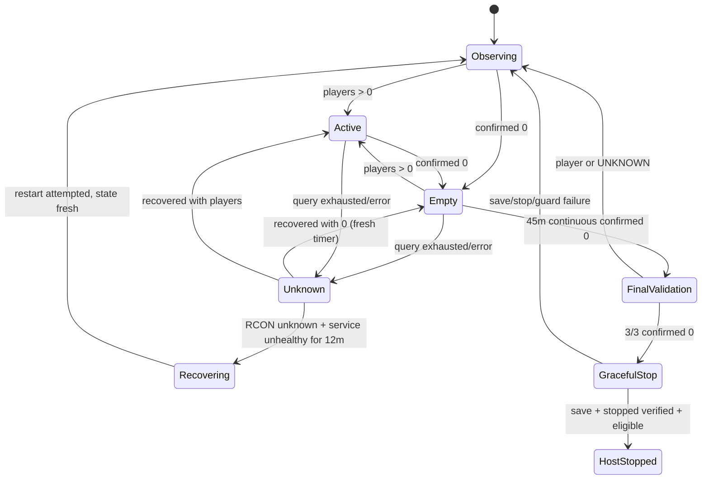

# Watchdog Safety Model

## Hard Invariants

1. An RCON error is `UNKNOWN`, never zero.
2. `UNKNOWN` immediately erases prior idle progress.
3. Process/container health is not a player-count fallback.
4. A service restart can follow only a continuous interval where RCON is unknown and local service health is explicitly unhealthy/stopped.
5. Host shutdown can follow only continuous confirmed emptiness plus all successful final checks.
6. A save failure, unrecognized save response, stop failure, failed exact-container verification, ineligible host, final player, or final unknown aborts host shutdown.
7. Windows and non-AWS environments cannot arm real shutdown through configuration.

## State Flow

## RCON Retry Semantics

`RetryingPlayerCounter` invokes `rcon-cli players` three times by default. After removing ANSI control sequences, it accepts only an exact `Players connected (N)` or `Players connected: N` header followed by exactly `N` `-player` lines. Bare numbers, count/list mismatches, empty output, warnings, duplicate/contradictory replies, stderr output, command errors, and timeouts are failures. `save` similarly requires the entire normalized response to be exactly `World saved` (or `World is saved`). Delay occurs between attempts, not after the last one.

This strict parser prevents an upstream response change from becoming a false empty count.

## Secondary Health

The Docker health check requires the Java `zombie.network.GameServer` process. It deliberately does not call RCON, making it an independent secondary signal. If RCON fails while the process remains healthy, or Docker inspection is itself unknown, the host remains online and no restart is justified.

PZ's local FIFO console supports commands, but reliable request/response correlation and a supported machine-readable player count are not available. Parsing log lines or process sockets would be guesswork, so no local player fallback is implemented.

## Management-Outage Recovery

When RCON management and the independent process/container health both fail, a separate 12-minute timer begins. Recovery before expiry clears it. At expiry the watchdog gracefully restarts the one unambiguous PZ Compose service. It never shuts down EC2 in response to a management outage. After the attempt, all outage and idle state starts fresh.

## Final Validation and Race Reduction

The zero observation that reaches 45 minutes is check 1. Checks 2 and 3 occur after 5-second delays. Every check uses the full retry/unknown semantics. The shutdown coordinator queries again immediately before save and again after the save-settle delay, before stopping. A reconnect or any management uncertainty aborts.

No game protocol offers an atomic "prevent joins and stop if empty" transaction. The five total confirmations narrow, but cannot mathematically eliminate, the tiny interval between the last query and stop. The conservative save/quit path and short validation spacing are the supported compromise.

## Shutdown Eligibility

Real host poweroff requires all of:

- `DEPLOYMENT_ENVIRONMENT=aws`
- `DRY_RUN=false`
- `HOST_SHUTDOWN_ENABLED=true`
- Linux, never Windows
- `/etc/pz-server/allow-host-shutdown` containing exactly `PZ_HOST_SHUTDOWN=ENABLED`

The production installer creates the guard because running Terraform for this production host is an explicit opt-in. Local Compose overrides dry-run and shutdown flags even if `.env` is edited.

EC2 has `instance_initiated_shutdown_behavior = "stop"`, so Linux poweroff stops rather than terminates it.

## Test Scope

Safety-core coverage includes active/empty transitions, timeout boundaries, reconnects, transient and exhausted RCON errors, warning/duplicate/ambiguous zero-exit output, unknown reset, healthy versus unhealthy secondary state, sustained outage restart, restart failure, recovery, pre/post-save reconnect/error, dry run, eligibility, exact save confirmation, single-container clean-exit verification, inspection failure, poweroff initiation failure, and service recovery.

Use shortened values only in local `.env` for an interactive dry-run test. Never arm AWS effects merely to accelerate testing.
